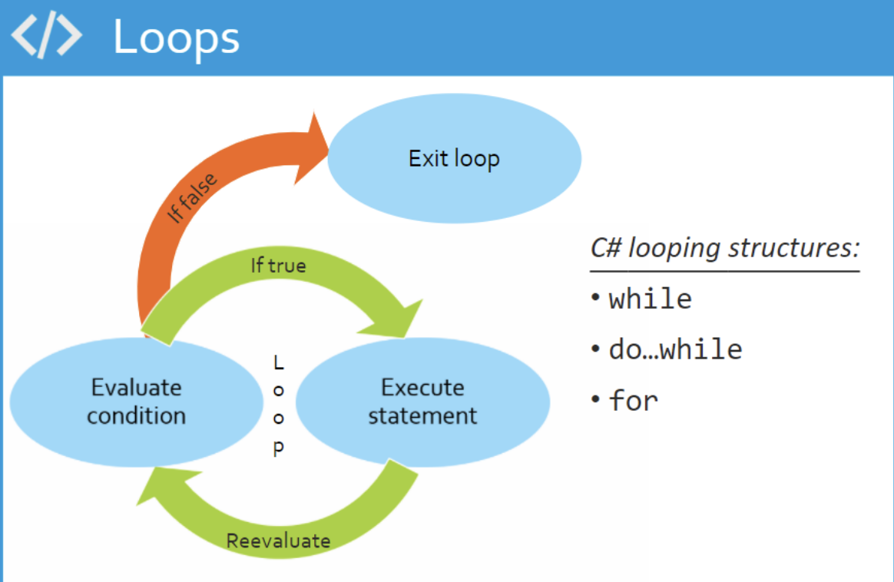

# Loops

A loop is used to repeat a block of code until the specified condition is met.

<p align="center">
    
</p>

## For Loop

```csharp
for (int i = 0; i < 5; i++)
{
    Console.Write(i + " ");
}
```
```shell
# output
0 1 2 3 4 
```

## While Loop

```csharp
int num = 0;
while (num < 5) {
    Console.Write(num + " ");
    num++;
}
```
```shell
# output
0 1 2 3 4 
```

## Do-While Loop

```csharp
int x = 0;
do
{
    Console.WriteLine(x);
    x++;
} while (x < 5);
```
```shell
# output
0
1
2
3
4
```


# Break and Continue Keywords

The **break** statement terminates the closest enclosing loop statement (that is, _for_, _foreach_, _while_, or _do_) or _switch_ statement.